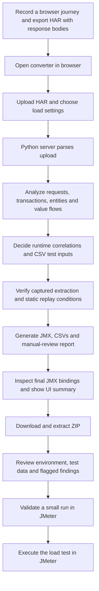
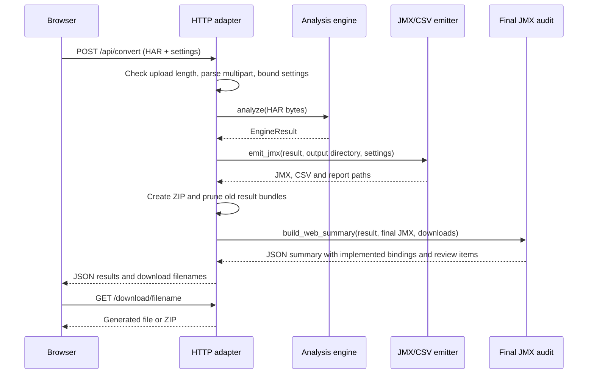

# Application architecture and complete flow

`har2jmx` converts a recorded browser journey into an Apache JMeter test plan.
It reconstructs relevant HTTP requests, identifies values that must come from
fresh responses, places approved test inputs in CSV files, and reports items
requiring review.

The implementation is a Python package with a browser UI, a standard-library
HTTP server, an analysis engine, and a JMX/CSV emitter. Runtime dependencies
are limited to Python's standard library. The converter analyzes captured
requests and responses; JMeter executes the resulting workload separately.

For installation and local startup on port 8000, see [LOCAL_SETUP.md](LOCAL_SETUP.md).

## Complete user journey



A HAR supplies the evidence available to the analysis engine: request order,
URLs, headers, cookies, bodies, responses, timestamps, and optional browser
initiator/frame context. Missing response bodies can hide the origin of a
runtime value. Record the full journey, including authentication and the
responses that issue values used later.

## Application boundaries

| Layer | Main files | Responsibility |
| --- | --- | --- |
| Browser UI | `static/index.html`, `static/app.js`, `static/styles.css` | Choose capture/settings, upload, render results, and expose downloads. |
| HTTP adapter | `server/handler.py`, `server/multipart.py` | Parse uploads, invoke the engine/emitter, assemble ZIPs, and serve files. |
| Analysis core | `engine.py` and analysis modules | Convert capture evidence into decisions and findings without making live application requests. |
| Artifact generation | `emit/jmx.py`, supporting emitter modules | Write JMeter XML, CSV datasets, and an optional review checklist. |
| Final reporting | `webreport.py` | Compare accepted correlations with emitted producer/consumer bindings and build the UI payload. |
| Execution | Apache JMeter, outside this package | Resolve runtime values, read test data, and send load-test requests. |

All package paths in this document are relative to `src/har2jmx/` unless a
repository path is shown explicitly.

Startup is `python -m har2jmx` (or the installed `har2jmx` command), which calls
`__main__.py` and then `server.handler.main()`. `ThreadingHTTPServer` serves
the browser UI and conversion API. The default address is `127.0.0.1:8000`.
`HAR2JMX_HOST` controls the bind address; port selection is `HAR2JMX_PORT`,
then `PORT`, then 8000. The Harsh-SDETTech repository's `.devcontainer/`
configuration installs and starts the same application in Codespaces.

## What happens when the user submits a HAR



Conversion runs synchronously within the request's server thread. There is no
database, background job queue, or external inference service in this flow.

| Route | Behavior |
| --- | --- |
| `GET /` | Serve the application page. |
| `GET /static/...` | Serve packaged JavaScript, styles, and HTML. |
| `GET /healthz` | Return `{"status": "ok"}`. |
| `POST /api/convert` | Analyze an uploaded HAR and generate downloadable results. |
| `GET /download/<filename>` | Download an existing output file. |

Malformed captures return a 400 response with an input error. Unexpected
conversion errors return a generic 500 response and write details to the server
log. Oversized uploads receive 413 before the body is read. Both the server and
browser default to a 250 MiB ceiling; the browser check is currently fixed,
while `HAR2JMX_MAX_UPLOAD_MB` configures the server limit.

## Analysis pipeline in engine.py

`analyze(har)` accepts HAR bytes or a parsed dictionary. The pipeline uses
captured evidence and heuristic rules for roles, lifecycle, field context,
protocol behavior, and known telemetry/service patterns. These rules have
limits; ambiguous cases and validation findings remain visible for review.

| Stage | Main module | What we do | Result |
| --- | --- | --- | --- |
| M1: normalize | `har/reader.py`, `ir/build.py`, `ir/normalized.py` | Parse every entry into request/response/body/context records. Preserve URL, ordered query pairs, form fields, file metadata, and response content. | `NormalizedCapture` |
| M2: request roles | `classify/request_noise.py`, `classify/content_role.py` | Tag authentication, business, polling, uploads/downloads, static assets, and telemetry. Consider business response contracts on static-looking paths. | Role/exclusion reasons on each request |
| M3: application/auth evidence | `understand/application.py`, `understand/auth.py` | Describe observed application style and authentication mechanisms. | Application and auth profiles |
| M4: transactions | `workflow/transactions.py`, `workflow/boundaries.py`, `workflow/naming.py` | Group supporting calls into user actions using navigation, timing, initiator, and request evidence; assign business names. | Ordered transactions |
| M5-M6: entities | `entities/discovery.py`, `entities/relationships.py` | Identify entities, attributes, relationships, and aligned observed rows. | Relationship/entity model |
| M7: lineage | `lineage/graph.py` | Inventory value observations and locate earlier response producers and later consumers through normalized equality/representation evidence. | Value-flow graph |
| M8: lifecycle/classification | `classify/value_engine.py`, `classify/lifecycle.py` | Distinguish configuration, existing business data, values created/issued during the journey, user input, and uncertainty. Consider GraphQL operation semantics. | Value verdicts with reasons |
| M9: correlations | `correlate/decide.py`, `correlate/necessity.py` | Discover candidates, choose extraction mechanisms, then gate candidates by downstream use and replay necessity. | Accepted correlations and rejection audit |
| M10: test inputs | `parameterize/intent.py`, `parameterize/context.py`, `parameterize/decide.py` | Approve individual user-input/selected-data slots; group columns and aligned rows into datasets. | Parameterization plan |
| M11: captured verification | `validate/replay.py`, `validate/extractors.py` | Check extraction order, missing runtime bindings, dataset conflicts, session repeatability, and extractor matches against recorded responses. | Replay findings and extractor checks |
| M12: metrics | `engine.py` | Collect request, transaction, correlation, dataset, and review metrics; label estimates/proxies. | `EngineResult.metrics` |

Excluded requests remain in the normalized capture with their reasons. The
emitter omits them from the scripted workload; normalization retains the full
capture for inspection. Authentication traffic contributes to replay and is
retained when classified accordingly.

`EngineResult` carries the capture, profiles, transactions, entity model,
classification, correlations, parameterization, replay report, extractor
checks, correlation audit, and metrics into emission and reporting.

## Correlation, parameterization, and fixed values

| Value role | Example | Generated behavior |
| --- | --- | --- |
| Fresh runtime dependency | Login token or an order ID returned by creation and consumed later | Extract from the producing response and reference `${variable}` in downstream requests, when accepted and verified. |
| Cookie session | Cookies issued by responses and later sent as cookies | Use JMeter's per-thread Cookie Manager where applicable. |
| Approved test input | Login identity, search text, quantity, or selected existing business data | Read from a CSV Data Set and reference its owned input variable in approved request slots. |
| Configuration/protocol metadata | Fixed settings or capability vocabulary | Retain the applicable literal/configuration behavior. |
| Insufficient evidence | Dynamic-looking value without a usable producer or binding | Surface findings/manual-review items according to classification and verification results. |

For example, an accepted flow may become:

```text
POST /login       body username=${username}, password=${password}
                  response token -> extractor variable authToken

POST /orders      header Authorization: Bearer ${authToken}
                  body quantity=${quantity}
                  response orderId -> extractor variable orderId

GET /orders/${orderId}
```

`username`, `password`, and `quantity` are CSV inputs. `authToken` and `orderId`
come from each virtual user's responses. An ID selected from an existing
catalog can follow a different policy from an ID created during that user's
journey, even when their field names match.

Candidate discovery and final acceptance are separate steps. The necessity
audit records configuration, protocol metadata, master data, missing consumers,
superseded candidates, review cases, and candidates not required for replay.

Qualified credential names such as `pf.username` use the explicit known leaf
name when approving credential inputs. `emit/bindings.py` keeps CSV owners
separate from runtime/configuration variables; conflicting CSV names receive
stable names based on their source slots.

## How the JMeter plan is built

`emit_jmx()` builds the XML first and removes parameter columns that have no
reference in the emitted plan. It then writes the corresponding CSV files and
an optional manual-review Markdown file.

The JMX includes a Test Plan, load variables, Thread Group, HTTP defaults,
Cookie/Cache/Header Managers as applicable, CSV Data Sets, Transaction
Controllers, HTTP samplers, response extractors, and assertions.

The browser's load settings map to concurrent `THREADS`, `LOOPS`, `RAMP`,
`HOLD`, and `THINKTIME`. A positive hold uses scheduled execution with repeating
iterations bounded by ramp plus hold; otherwise loop count controls repetition.
When think time is blank, the emitter derives pacing from captured timestamps.
User pauses are placed between transactions rather than between every request
within an action. Response-code assertions belong to individual HTTP samplers.

### Preserve URL and body ownership

Ordered query parameters belong in `HTTPSampler.path`; form fields belong in
body arguments. JSON, GraphQL, XML, SOAP, and text retain their body
representation. Compatible captured query spelling is preserved, including
duplicates and blank values. Changed query values use JMeter's `__urlencode`
after runtime substitution; form arguments use their normal runtime encoding.

An accepted percent-encoded SAML form value can bind to its canonical runtime
variable only in an approved later consumer request. That binding does not
create a new dependency or add an encoded alias to the global value map.
Multipart emission retains supported fields and file metadata; actual upload
files must be supplied when running the plan.

### Authentication and redirects

`emit/authentication.py` resets accepted thread-local authentication variables
at their producers and stops a thread when required fresh state is missing.
An unverifiable accepted authentication dependency remains a runtime reference
with failure checks and a review finding, avoiding reuse of a recorded secret.
Other unresolved extractors follow the existing literal/manual-review policy.

`emit/redirects.py` assigns each observed redirect chain one execution path.
Compatible automatic chains use JMeter following and omit separately captured
target samplers. Explicit chains disable following and use extracted Location
state with runtime URI resolution. The Location owns the target URL/query.
`correlate/cookies.py` supplies the bounded Set-Cookie grammar shared by cookie
extraction and verification.

### CSV data and artifacts

CSV files contain only surviving dataset columns with their final owned names.
The emitter starts from observed data and may expand eligible business inputs
toward the requested user count. Fixed identity-like values are cycled rather
than inventing existing records. Engineers still need to provide valid accounts,
business records, and realistic load-test data.

| Artifact | Purpose |
| --- | --- |
| `har2jmx_<id>.jmx` | Generated JMeter plan. |
| `har2jmx_<id>_<dataset>.csv` | Input data for a surviving dataset, when present. |
| `har2jmx_<id>_manual_review.md` | Checklist of unresolved or incomplete runtime bindings, when present. |
| `har2jmx_<id>.zip` | Bundle assembled by the web adapter containing the plan, CSVs, and reports. |

`paths.py` selects the output directory. In a source checkout it defaults to
`generated/`; `HAR2JMX_OUTPUT` overrides it. `HAR2JMX_KEEP_RESULTS` controls
retention of recent file bundles (default 50). There is no persisted database
of captures or conversion jobs. Hosted temporary files depend on the host's
storage lifetime; local generated files remain until removed or pruned.

## Final JMX audit and UI reporting

The UI's **Implemented correlations** count comes from inspection of the emitted
JMX, alongside captured extractor checks. For explicit extractors, the report
checks an enabled extractor on the expected producing sampler and variable
references in every approved later consumer's request path, arguments, or
headers. Labels, assertion strings, and processor text do not count as request
consumers. Cookie Manager correlations use their own mechanism check.

Incomplete or partial bindings are removed from the implemented list and added
to manual review in the UI and downloaded checklist. Capture-quality reporting
also describes response-body coverage, timing availability, and recorded error
responses. These reports describe captured/emitted evidence rather than a live
test outcome.

`emit/validate.py` exposes a separate static XML validation utility for plan
components, unused variables/columns, and unresolved references. The web upload
path does not run this utility or launch JMeter automatically.

## Current limits and verification

The live lineage graph groups observations by normalized literal and can confuse
unrelated equal values. JSON compatibility locations also lose some array
identity. `lineage/occurrences.py` provides an explicit inspection-only index
with event, origin, path, pair/array, and representation coordinates. It is
exported but is not invoked by `engine.analyze()` to replace ownership decisions.
The occurrence foundation therefore does not resolve all runtime identity
collisions. See [P2_4A_OCCURRENCE_IDENTITY_MODEL.md](P2_4A_OCCURRENCE_IDENTITY_MODEL.md)
and [P2_4_VALUE_IDENTITY_ANALYSIS.md](P2_4_VALUE_IDENTITY_ANALYSIS.md).

The replay score is a static assessment. Matching a recorded extractor and
seeing variables in the final XML cannot establish fresh-session success,
business data validity, or live HTTP behavior. Validate the downloaded plan
with a small JMeter run and review findings before increasing load.

`tests/` covers parsing, classification, correlation, CSV ownership,
authentication, redirects, request fidelity, transactions, reporting, and the
server. `.github/workflows/ci.yml` installs the package, runs the regression
suite, and executes `scripts/smoke_deployment.py` to check the installed service
and packaged UI assets. `render.yaml` defines hosted startup and deployments
after passing checks once Render is connected.

## Repository map and related guides

```text
src/har2jmx/
  __main__.py             application entry point
  server/ + static/       web upload, conversion routes, results UI
  har/ + ir/              HAR parsing and normalized request/response records
  understand/             observed application/authentication profiles
  workflow/               user-action boundaries, names, transactions
  entities/               entities, relationships, aligned rows
  lineage/                value flow and optional occurrence inspection
  classify/               request roles, content evidence, value lifecycle
  correlate/              candidates, necessity gate, cookie grammar
  parameterize/           approved test inputs and datasets
  validate/               recorded extractor and static replay checks
  emit/                   JMX, CSV, runtime checks, redirect execution
  engine.py               analysis orchestration and metrics
  webreport.py            final JMX binding audit and browser JSON
  paths.py                static asset and output locations
tests/                    fixtures and regression coverage
scripts/                  installed-service smoke check
docs/                     architecture, usage, analysis, benchmark evidence
generated/                generated artifacts, ignored by Git
```

- [LOCAL_SETUP.md](LOCAL_SETUP.md): clone, install, start, configure, and use JMeter.
- [PARAMETERIZATION.md](PARAMETERIZATION.md): input decisions and CSV substitutions.
- [SUPPORTED_PATTERNS.md](SUPPORTED_PATTERNS.md): supported locations and known limits.
- [REQUEST_FIDELITY_ANALYSIS.md](REQUEST_FIDELITY_ANALYSIS.md): URL/query/body repair.
- [UI_CORRELATION_IMPLEMENTATION_2026-10-08.md](UI_CORRELATION_IMPLEMENTATION_2026-10-08.md): emitted-binding reporting.
- [DEPLOYMENT.md](DEPLOYMENT.md): hosted service and automatic deployment setup.
- [benchmarks/real100-20261008/README.md](benchmarks/real100-20261008/README.md): frozen benchmark evidence and assessment limits.
