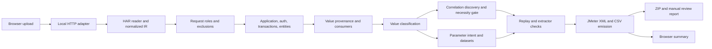

# Architecture review

Reviewed on 2026-10-01 against commit `e99c36b`.

## Assessment

This is a promising local performance-engineering utility with a sensible compiler-style architecture. Its strongest design choice is separating HAR normalization, dependency analysis, correlation decisions, parameterization, and JMeter emission. Retain that structure.

The current implementation should be treated as an assisted script generator whose output needs validation. The claims of universal, production-ready replay exceed the evidence in the implementation and tests. Most material risks concern semantic correctness: XML can be valid while the requests, runtime dependencies, or data associations are wrong.

This review covers all 41 Python source files, all 34 Python test files, the HTML/JavaScript/CSS, packaging configuration, documentation, ignore rules, and the 68 HAR files across examples, fixtures, and the bundled UI sample. Package initializers and the generated directory placeholder were included. Git internals were excluded.

Verification performed: source inspection, HAR JSON parsing and inspection, nested JSON body checks, and a check that the 38 distinct literal JavaScript DOM selectors have corresponding HTML IDs. The 68 HAR files contain 284 entries in total; individual files contain 1–11 requests. Their 321 nonempty JSON-labelled request/response bodies parsed successfully with PowerShell. These checks establish sample consistency, not converter correctness.

Python tests, Ruff, mypy, browser interaction, and JMeter execution were not run. The available Python command could not execute. `uv python find` encountered a restricted cache, and the escalation attempt was not executed because automatic approval review failed with an unavailable API deployment (404). No runtime pass claim is made here.

## System model

Runtime dependencies are standard-library only. The HTTP adapter uses `ThreadingHTTPServer`; the browser uses ordinary DOM operations and `fetch`. There is no database, background job system, external inference service, or automatic live replay.

`engine.analyze()` is the analysis entry point. It builds new dataclasses and passes them through sequential reasoning stages. Classification and transaction discovery annotate the normalized capture in place. `EngineResult` holds the resulting decisions, findings, extractor checks, and metrics.

`emit_jmx()` generates the test plan, prunes unused parameter columns, writes CSVs, synthesizes selected data variants, and produces a manual-correlation report when necessary. The server packages those files and builds a browser summary. The generated XML is consulted when deciding which correlations appear in the UI.

## Module responsibilities

| Files / area | Actual responsibility |
|---|---|
| `__main__.py`, package initializers | Entry point and public imports |
| `har/reader.py` | HAR decoding, headers, cookies, form/file parts, base64 response content |
| `ir/normalized.py`, `ir/build.py` | Dataclass model and request/response body typing |
| `classify/request_noise.py` | Static/vendor/path exclusions, request roles, polling, recorded refresh-failure suppression |
| `understand/models.py`, `application.py`, `auth.py` | Evidence-labelled framework, protocol, identity, and auth detection |
| `workflow/transactions.py` | Timing/navigation groups, anchor selection, transaction names, fragment merging |
| `entities/discovery.py`, `relationships.py` | JSON entity shapes, identifiers, relationship evidence, merged instance rows |
| `lineage/graph.py` | Normalized-value inventory, response producers, later request consumers, embedded-value search |
| `classify/value_engine.py` | Static/master/runtime/unknown classification using lifecycle plus heuristics |
| `correlate/decide.py`, `necessity.py` | Extractor candidates, naming, necessity decisions, supersession |
| `parameterize/intent.py`, `decide.py` | User/selection/system intent, CSV columns, selected rows, dataset consolidation |
| `validate/replay.py`, `extractors.py` | Static decision consistency and matching extractors against recorded responses |
| `emit/jmx.py`, `validate.py` | JMeter components, substitution, CSV output, static XML checks |
| `webreport.py` | Display metrics, capture quality, correlation audit, manual-review data |
| `server/handler.py`, `multipart.py` | Upload handling, configuration limits, conversion, ZIP downloads, output retention |
| `static/index.html`, `app.js`, `styles.css` | Upload/workload UI, simulated progress animation, result rendering, responsive styling |
| `patterns.py`, `utils.py`, `paths.py` | Shared patterns, names, package/output locations |

## Strengths to preserve

- One normalized capture gives stages a shared model and retains excluded entries for auditability.
- Producer/consumer matching is more disciplined than unrestricted string replacement during discovery.
- Correlation and CSV parameterization are explicit, separate decisions with recorded reasons.
- The necessity audit and extractor verification are useful foundations for explainable conversion.
- Cookie Manager handling, redirect extraction, refresh sequences, CSRF rotation, GraphQL, SOAP, and multipart parts have targeted test coverage.
- The emitter accounts for JMeter's element/hashTree layout, CSV headers, UTF-8, timeouts, and timer scope.
- The local adapter bounds individual upload sizes and retains a bounded number of result bundles.
- The UI escapes most text derived from captures and filters displayed correlations against generated extractors.

## Priority findings

### 1. High: raw request bodies lose URL query parameters

In `emit/jmx.py:277`, a JSON/GraphQL/XML/text body selects the `raw_body` branch. Query arguments are only emitted in the alternative branch at line 297, while `HTTPSampler.path` is populated from the path without the query string.

For example, `POST /orders?tenant=acme` with a JSON body becomes a sampler for `/orders` with the body but without `tenant=acme`. This is a direct request-reconstruction gap. None of the checked HAR samples combines a nonempty recorded raw body with a URL query string, so that corpus does not exercise it.

Preserve query arguments independently of body representation. For raw bodies, append an appropriately encoded query string to the sampler path and keep only the body in the raw argument.

### 2. High: value identity and substitutions lack complete scope

`lineage/graph.py:347` indexes occurrences by normalized string value, and line 363 selects the earliest producer across that whole flow. `emit/jmx.py:153` builds a global literal-to-variable map. Parameter slots retain request indices, but `_param_slot_subs()` discards those indices, and `_slot_apply()` falls back to the global map at line 115.

Consequently, unrelated identities that happen to both equal `1001` can become one flow or substitution target. Separate server issuance events with the same recorded value cannot be represented independently. A matching literal in an unrelated request slot can inherit a variable without evidence of that relationship.

Use explicit occurrence identities: request index, side, structured location, path/list position, original type, and transform. Treat equal values as possible edges, not as definitive identity. Resolve producer events and rewrite only the approved consumer occurrences.

### 3. High: numeric JSON parameters change type

`_sub_json()` in `emit/jmx.py:197` returns replacement expressions as Python strings, then `_json.dumps()` serializes them. A numeric input such as `{"qty":3}` becomes `{"qty":"${qty}"}` and resolves to a JSON string at runtime.

APIs that require numbers can reject this request. The existing short-numeric JSON test checks for the variable's presence rather than preservation of its JSON type.

Introduce typed replacement nodes or a body template renderer that preserves numeric tokens and correctly escapes runtime strings. Apply analogous escaping rules to XML/text output; CSV values containing quotes or markup must remain valid in the destination format.

### 4. High: successful capture matching is mistaken for runtime certainty

At `emit/jmx.py:763`, `UNIQUE` extractor verification combined with `High` confidence suppresses the correlation-health assertion. Tests explicitly expect this omission.

A recorded login response can contain a uniquely matching token while a later load-test login returns HTTP 200 with an error body and no token. The response-code assertion passes, the variable becomes its `NOT_FOUND` default, and the missing-token sample lacks its own health guard.

Verify every required runtime extraction during execution. Recorded-response verification and runtime assertions solve different problems. Update tests and documentation together.

### 5. High: replay readiness is calculated before final feasibility is known

`engine.py:120` runs replay validation before extractor verification at line 123. Unresolved extractor checks do not update the replay findings or score. The emitter intentionally drops those extractors and retains recorded literals; `validate_plan()` explicitly exempts these escalated literals.

The result can therefore report a passed replay check even though a required extraction was later found unusable. Also, the JMX comment counts only `classification.needs_correlation()` at `emit/jmx.py:695`, omitting unresolved extractor checks that are included in the manual report.

Evaluate readiness from the final emission manifest, including all required extraction failures and manual items. Distinguish analysis completed, structurally valid, needs manual work, and runtime verified. An empty static-validator issue list is not proof of production replay.

### 6. High: hidden UUID-shaped tokens are rejected as configuration

`correlate/necessity.py:143` rejects a hidden input or meta value matching a GUID when its length is at most 40, with the explanation that it is a stable application identifier. This branch precedes the downstream credential check.

A CSRF token can legitimately be a UUID. Value shape alone cannot establish that it is constant across users. The rejection can suppress a necessary correlation and is then exempted from the missing-runtime check by the rejection audit.

Use lifecycle and consumer context before configuration heuristics. Unknown stability should produce a review decision, not an asserted configuration fact.

### 7. Medium: response traversal silently ignores data beyond fixed limits

Lineage and entity discovery inspect only the first 25 list items and stop beyond depth 6. Extractor verification shares similar limits. Embedded-value discovery examines only the nearest 300 prior responses.

A consumed ID at item 37 or a deeply nested token may lose its producer evidence. Verification over a truncated list also cannot establish uniqueness over the entire response. These are correctness limits, not merely performance optimizations, and are not surfaced as analysis warnings.

Preserve or report traversal truncation. Make budgets configurable, and label decisions whose provenance or uniqueness checks are incomplete. Add captures substantially larger than the current 1–11 request samples.

### 8. Medium: header hoisting broadens recorded behavior

`_collect_common_headers()` in `emit/jmx.py:515` hoists a header when it appears with one value on about 60% of business requests. The resulting manager applies it to every sampler, including requests and secondary hosts where it was absent.

Although `Authorization` is excluded, custom token headers and other request-dependent headers are eligible. Their scope can be broadened unintentionally, and a correlated header can be applied before its producer.

Hoist only headers valid for every sampler in the relevant host/scope, or partition header managers by exact applicability. Keep runtime-state headers on their approved requests.

### 9. Medium: CSV planning does not establish per-user consistency

Single-row datasets are consolidated, but multirow datasets use separate `shareMode.all` CSV readers. Their row allocations are independent. Entity relationships are discovered, yet there is no explicit joint allocation mechanism for related rows across files.

Input columns also use `inputs.setdefault(col, d)` at `parameterize/decide.py:146`, so distinct values in the same-named input field can be collapsed into the first decision. CSV synthesis caps growth at 200 rows while the web adapter permits 2,000 threads. Credentials and real IDs are correctly retained, but this means thread count does not imply distinct identities. Arbitrary suffix/increment synthesis can also generate invalid catalog selections or break business constraints.

Define datasets by logical field and lifecycle scope, preserve distinct journey steps, and allocate related rows together. Make synthesis an explicit policy with field constraints and distinguish observed rows from generated rows in reports.

### 10. Medium: exclusions and workflow inference can override dependencies

`classify_request()` excludes HEAD requests and tests static path/extensions before auth and download roles. A `.pdf` download or an asset-path response that sets required state can be removed before its business significance is evaluated.

Refresh-failure suppression searches arbitrarily far ahead for a refresh and a retry matching only method/path. It does not compare host, query, or body. Transaction burst merging also uses a fixed 2.5-second threshold; observed pacing uses request-start gaps rather than actual user pauses after response completion. Parallel browser calls are emitted sequentially.

Use an initial role classification followed by dependency-aware exclusion reconciliation. Narrow retry equivalence and lifecycle boundaries. Report inferred transactions/pacing as estimates and allow adjustment.

## Maintainability and adapter observations

- `emit/jmx.py` combines substitution, JMeter component construction, dataset pruning, synthetic data, and report generation. Split it around those responsibilities after correctness is pinned by tests.
- Emission mutates `EngineResult.parameterization`, while analysis metrics were calculated earlier. UI row counts describe observed rows, not necessarily the synthesized CSV rows. Prefer an immutable analysis result and a separate emitted-artifact manifest.
- Domain layers import private helpers from each other, and public convenience functions can recompute lineage, entities, or auth. Expose stable shared traversal and evidence APIs; reuse a per-analysis context.
- Classification uses numerous name/shape heuristics despite documentation claiming decisions are never name-based. Some constants and rules in `patterns.py` appear to be remnants of older implementations. Document heuristic use accurately and audit unused exports.
- `paths.py` creates the output directory at import time. Its installed-package fallback derives a location near `site-packages`, which may not be writable. Select a user-writable output path at startup instead.
- The HTTP server reads and parses the complete upload in memory, has no bounded conversion-worker pool, and pruning is not synchronized with concurrent conversion/download activity. The 250 MB upload ceiling is a per-request bound, not a total memory bound.
- `SimpleHTTPRequestHandler` serves the package root, permitting directory/source access beyond the static UI. Download files have no user ownership separation. The default localhost scope fits a personal utility; documented LAN sharing needs a deliberately designed shared-service adapter.
- HAR validation checks only that `log.entries` exists. Invalid structural types can fall into generic 500 responses. Validate container types, URLs, statuses, body representations, and empty captures at the input boundary.
- The browser progress steps are timed animation, not actual backend progress. Server upload-limit overrides are not reflected in the browser's fixed 250 MB limit. Parameterization-review data is returned but not rendered in the UI.
- Package versions disagree: `pyproject.toml` declares `0.1.0`; `__init__.py` declares `1.0.0`.
- No CI configuration is present in this checkout. The test suite is broad but largely fixture/structural based, contains legacy standalone runners and some always-true assertions, and does not demonstrate actual JMeter request execution. The dry-run corpus excludes non-`sample_*` fixtures such as fragmented-auth and SPA-burst files.

## Recommended sequence

1. Pin request fidelity with regression cases for query-plus-raw-body requests, numeric JSON types, runtime escaping, repeated equal values, and producer/consumer order.
2. Introduce explicit scoped substitution bindings and a final emission manifest. Base CSV usage, correlation display, reports, and readiness on that manifest.
3. Apply runtime health assertions to all required extractors. Include unresolved checks in readiness and JMX comments; fix hidden UUID token handling.
4. Add meaningful integration tests: a local deterministic HTTP application, generated JMX executed by JMeter with 2 users and 2 loops, and assertions on the received requests and distinct sessions. Cover cookies, redirects, token rotation, typed bodies, and multipart uploads with supplied files.
5. Add large/deep captures and report analysis-budget limits. Measure per-stage time and peak memory before selecting concurrency and traversal policies.
6. Separate emitter responsibilities, remove obsolete rules, unify versions, make output setup explicit, and add Python 3.10+ CI with pytest, Ruff, and mypy.

A microservice rewrite or new framework is unnecessary for the current local product. The most valuable investment is making replay decisions precise, scoped, testable, and honest about their evidence.
